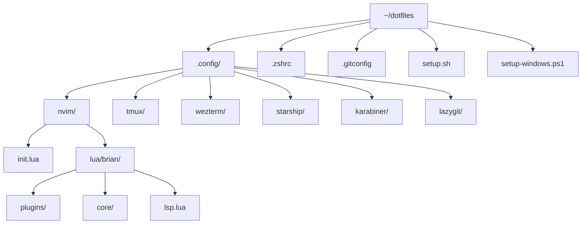

# Dotfiles

Personal development environment configuration for macOS, Linux, and WSL.

## Quick Start

```bash
# Clone repository
git clone https://github.com/brianpooe/dotfiles.git ~/dotfiles
cd ~/dotfiles

# Run setup script
./setup.sh

# Symlink configurations
stow nvim tmux zsh starship wezterm
```

## Setup

### macOS / Linux

```bash
chmod +x setup.sh && ./setup.sh
```

### Windows (WSL)

1. Run on Windows host (PowerShell as Admin):
   ```powershell
   .\setup-windows.ps1
   ```

2. Inside WSL:
   ```bash
   ./setup.sh
   ```

## What Gets Installed

| Category | Tools |
|----------|-------|
| Shell | zsh, starship, zoxide, fzf |
| Editor | neovim, lazygit |
| Terminal | wezterm, tmux |
| CLI Utils | bat, eza, fd, ripgrep |
| Languages | Node.js (via NVM), Python, Go, Rust, Lua |
| Other | GNU stow, TPM (tmux plugins) |

## Structure



## Configurations

### Neovim

- Plugin manager: **lazy.nvim**
- LSP: Mason for auto-installing language servers
- Completion: blink.cmp
- Theme: Kanagawa
- File explorer: nvim-tree
- Fuzzy finder: Telescope
- Testing: neotest
- Debugging: nvim-dap

### Tmux

- Plugin manager: TPM
- Prefix: `Ctrl+a`
- Vim-style navigation
- Session persistence with tmux-resurrect

### Shell (Zsh)

- Prompt: Starship
- Better `cd`: zoxide
- Better `ls`: eza
- Better `cat`: bat

## Using GNU Stow

Stow creates symlinks from `~/dotfiles` to your home directory:

```bash
cd ~/dotfiles

# Individual packages
stow nvim       # ~/.config/nvim -> ~/dotfiles/.config/nvim
stow tmux       # ~/.config/tmux -> ~/dotfiles/.config/tmux
stow zsh        # ~/.zshrc -> ~/dotfiles/.zshrc

# All at once
stow */

# Remove symlinks
stow -D nvim
```

## Key Bindings

### Neovim

| Key | Action |
|-----|--------|
| `<Space>` | Leader key |
| `<leader>e` | Toggle file explorer |
| `<leader>ff` | Find files |
| `<leader>fg` | Live grep |
| `<leader>lg` | Open Lazygit |
| `<C-h/j/k/l>` | Navigate splits/tmux panes |

### Tmux

| Key | Action |
|-----|--------|
| `C-a` | Prefix |
| `prefix + I` | Install plugins |
| `prefix + \|` | Vertical split |
| `prefix + -` | Horizontal split |
| `C-h/j/k/l` | Navigate panes (vim-style) |

## License

MIT
